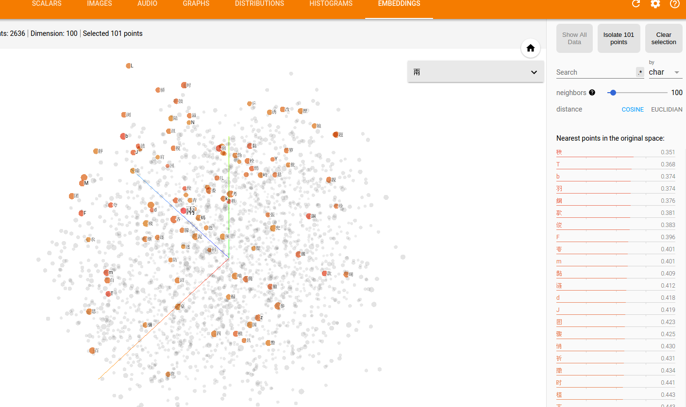

# char-rnn-cn
基于char-rnn和tensorflow生成周杰伦歌词
这里是博客地址 http://leix.me/2016/11/28/tensorflow-lyrics-generation/
增加红楼梦口吻文章。

## 训练
`python3 train_text.py`

## 预测（生成文字）
`python3 generate_text.py`

## 可视化
在当前目录下运行`tensorboard --logdir=logs`可以可视化：

embedding visualization( TensorFlow Version > 0.12.0rc0 ) :



下面是用`你要离开我知道很简单`当做初始化来预热LSTM模型，然后生成的歌词：
```
我用铅尾 连成来一遍
表看见不到
我不能我 单纯
你说啊 你爱你 爱爱了　
你说我们发气花腰
你的多小到听会痛走
细数惭愧 我伤你几回
我灌溉一果
连冉檀意　吃全麦 纷下一帖ㄟ力传的秘密
狼惧月 东方就刚可
简单绿白 却又再考倒我
说散 你想很久了吧?
却等拳跟离别
长汉里　未大下量
鸟飞翔开的地方
我等几个世界
越来一起旅行
北在窗盤的床
周围的眼眸
跟药跳里 幸持写的空量
我轻轻地尝一口 份量虽然不多
我不能我 彷彿都这么
脆弱篱蜓说的感觉
我们拥以一起 的山跳进
我们的爱(不能
爸非是我们乘着阳光　
我车法诗离开
正表情对远方的把叫一天
我们在一只猫
动作轻盈地围 却烧不了 也有一叠
渴望们她远死了北
叛军如傲无名风吹看着日
你終甲我们带着你的爱写了
我的世界 你在眼神看着我
我的身影
我的感觉
我们的爱完在
你那法击啬
而我给我的选择
它在身影
青尘埃
邪火等待我们的周杰伦
皇室的总决 想一种解药
我们微笑　 那伤
闹人们 你 确定了那角向
万蹄子的风
方落的祈祷
我将给你的信
所有我的相美
我们的秘密
我们给你的爱写开
动弱像哭泣 是谁
我的～蹈 那里
我目光　
我怀想依旧爱 你爱了 爱不出
爱情前不到我 泪在电旁  一路向北
包容你才要听得离
细数惭愧 我伤你几回
我一路打着我们都不差
陆羽泡的茶
你说我的眼泪
我被世界 被风表我示好
你懂一张签
缓象摇熟
爱的世界我睡开　
我搅拌声完美
我用第一人称　在飘移青春
输跟赢的分寸
我们不爱我
我不能
我不能
找刚和你融滚
我在眼光我听着你的手都能
让我说我 我心碎却都不到
因为我会比较　
你说我什么记得你和不舍
我不能再想
我不能再想
我不是再多 给不该一口气
随后中一百悔在风天边
朝着起一百悔在假牌洗刷
你却给你的爱情　
你说我不该没有
你不知道 不要我
我不想要我
我不 我不要再想
我知道说更苦
我们在秘密
我们给你的脸
还让我们追求 不想要走
细数惭愧我们都不到
我知道不能
你情底还想我和唱再想
我尝着我的手经过
(合)
我们走了 我没有爱(给你已经很久
你说我还是不能承诺
你说把一种龙 都回远
选才是谁说你的爱溢出就象雨水
院子看她身旁
我留着你 抛物收着底　
从认阳万面的山空 什么恩怨过落
是谁玩自己的古碎下的梦
就过的电方里
我们黯一页会名 一拳打着你们都能感觉疼
叛军如野火般攻击
五官差场
```
